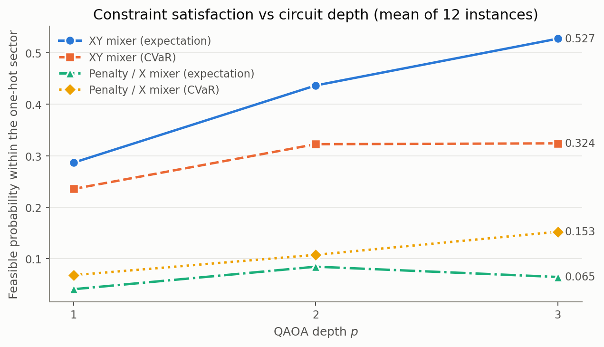
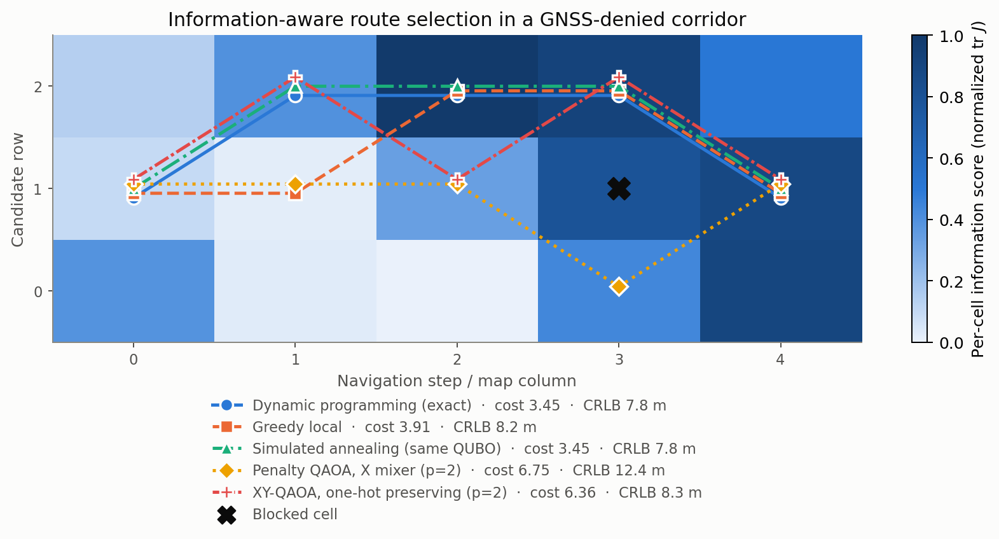

# Q-MagOpt

**Constraint-aware quantum optimization for information-aware magnetic navigation in GNSS-denied environments.**

When GNSS is unavailable, a vehicle can localize by matching a measured magnetic field
against a stored anomaly map. Map matching works well over some terrain and badly over
other terrain — and the route planner gets to choose which terrain it flies over.
Q-MagOpt asks whether that trade-off can be posed in the encodings quantum optimizers
consume, and measures what it actually buys.

> **This is a formulation and benchmarking study, not a claim of quantum advantage.**
> Every instance here is solved exactly, and far faster, by classical dynamic programming
> or by simulated annealing on the same QUBO. That comparison is run and reported, not
> avoided.

---

## The main result

The usual way to reward "magnetically informative" cells is to invent a per-cell score
and sum it along the route, because a QUBO only admits quadratic terms and the criterion
you actually want — the determinant of the accumulated Fisher information — is not
separable.

**That concession is unnecessary.** For two-dimensional position, `det J` is *exactly*
quadratic in the binary route variables:

```
det J(x) = det J₀
         + Σᵢ    xᵢ    [ J₀₁₁ Fᵢ,₂₂ + J₀₂₂ Fᵢ,₁₁ − 2 J₀₁₂ Fᵢ,₁₂ ]
         + Σᵢ<ⱼ xᵢ xⱼ  |gᵢ × gⱼ|² / σ⁴
```

This is the Cauchy–Binet expansion, and the pairwise coefficient is the **squared cross
product of the two cells' field gradients** — large when they are perpendicular, zero
when parallel. So the encoding rewards gradient-*direction diversity* by construction,
which is exactly what a sum of per-cell scores is blind to. No surrogate, no auxiliary
variables, no extra qubits.

Verified against the true determinant over every route to ~1e-18
([`test_cauchy_binet_expansion_is_exact`](tests/test_d_optimal.py)).

**What it buys**, solving both objectives exactly so the comparison isolates the encoding
from the solver (40 instances):

| Objective | Median position CRLB | Mean | Never worse | Strictly better |
|---|---:|---:|---:|---:|
| Separable per-cell surrogate | 10.84 m | 11.69 m | — | — |
| **Exact D-optimality (`det J`)** | **8.78 m** | **9.62 m** | 40/40 | 22/40 |

**What it costs**, and this is the interesting part: information couples *every pair* of
time steps, not just adjacent ones. The QUBO becomes all-to-all connected — and **the
dynamic program stops being valid**, because no single-step state summarizes the
accumulated information matrix. `solve_dynamic_programming` raises rather than quietly
returning a wrong answer. Simulated annealing on the same QUBO also stops reaching the
optimum on every instance. Taking the physics seriously is what makes the problem hard,
rather than inflating the instance size.

---

## Why the information term is Fisher information

A scalar total-field magnetometer over a mapped anomaly field returns `z = B(p) + n`
with `n ~ N(0, σ²)`, where σ combines sensor noise and map error — and in a real error
budget the map error dominates, even for a quantum magnetometer. The Fisher information
for horizontal position is then

```
J(p) = ∇B(p) ∇B(p)ᵀ / σ²        [1/m²]
```

Two consequences drive the whole project:

1. **`J` is rank one.** A single scalar reading constrains position only along the local
   gradient direction. The perpendicular direction is unobservable from it.
2. **Information is a property of the trajectory, not of a cell.** Position becomes
   observable only by accumulating readings whose gradients point in different
   directions — which is what makes route selection a real optimization problem.

Everything is reported in physical units. On the reference instance, dead reckoning alone
gives a 283 m position CRLB; route choice moves it between **7.8 m and 26.3 m**.

The original ad-hoc score (normalized gradient magnitude blended with field "rarity") is
retained as `information_model="heuristic"` for ablation. Its gradient half turns out to
be a crude, unit-free stand-in for the Fisher trace; the rarity half has no
estimation-theoretic justification.

---

## Constraint-preserving QAOA, compared fairly

At each step exactly one row is occupied: `Σᵣ x[t,r] = 1`. The penalty encoding enforces
this with a squared penalty. The XY encoding initializes each time layer in its
one-excitation subspace and mixes with an XY mixer, so the constraint is preserved by
construction.

The penalty ansatz searches 2¹⁵ = 32768 basis states; the XY ansatz searches 3⁵ = 243.
Reporting that XY puts more probability on feasible states would mostly be reporting that
its search space is 135× smaller. **Every result therefore also carries the conditional
feasibility inside the one-hot sector**, which isolates the mixer's actual contribution.

Under that fair comparison the XY advantage is real but roughly **5×, not 200×** — and it
grows with depth, while the penalty encoding's does not reliably.



Mean over 12 random instances, INTERP warm-started layer to layer. Without INTERP, deeper
circuits routinely score *worse* because the classical optimizer stalls.

---
## Integrated navigation experiment

Q-MagOpt was connected to the Q-MagNav particle-filter simulator to test whether
information-aware route selection translates into lower realized localization error
after GNSS loss. Across 1,800 synthetic missions, D-optimal routing reduced mean
post-GNSS-loss RMSE by approximately 6–7% compared with shortest-path routing,
while increasing mean route length by 1.85%. The improvement was clear in the
8 nT noise scenario and suggestive at 2 nT; no clear advantage over the simpler
separable-information baseline was established.

See the complete methodology, reproducible code, raw results, statistical analysis,
and limitations in [`experiments/magnav_benchmark`](experiments/magnav_benchmark).

## Benchmark

`python scripts/benchmark.py` (about 5 minutes). Twelve random instances, depths 1–3,
both variational objectives, aggregated:

| Solver | Objective | p | Approx. ratio (median) | P(feasible \| one-hot) | s |
|---|---|---:|---:|---:|---:|
| Dynamic programming (exact) | — | — | 1.000 | — | 0.00 |
| Simulated annealing (same QUBO) | — | — | 1.000 | — | 0.11 |
| XY-QAOA | CVaR | 1 | 1.000 | 0.236 | 0.35 |
| XY-QAOA | CVaR | 2 | 1.000 | 0.322 | 0.54 |
| XY-QAOA | CVaR | 3 | 1.000 | 0.324 | 0.61 |
| XY-QAOA | expectation | 3 | 0.917 | 0.527 | 0.67 |
| Penalty QAOA | CVaR | 3 | 0.857 | 0.153 | 5.78 |
| Penalty QAOA | expectation | 3 | 0.536 | 0.065 | 5.19 |

Read this honestly: **the classical methods win**. Dynamic programming is exact and
instant; simulated annealing on the identical QUBO reaches the optimum on essentially
every instance. What the variational results show is that the *encoding* choices —
constraint-preserving mixer, CVaR objective, INTERP warm starts — each move the needle in
the expected direction, which is the useful finding at this scale.

The approximation ratio is `(C_worst − C) / (C_worst − C_opt)` over hard-feasible routes:
1.0 is optimal, 0.0 is the worst legal plan. The conventional `C_opt / C` is unusable
here because the objective mixes rewards and costs and crosses zero.

---

## Install and run

```bash
python -m venv .venv && source .venv/bin/activate   # Windows: .venv\Scripts\activate
pip install -e '.[dev]'

python scripts/run_demo.py                                        # reference instance
python scripts/run_demo.py --information-objective d_optimal      # exact det J encoding
python scripts/benchmark.py                                       # statistical sweep (~5 min)
pytest                                                            # 120 tests, ~4 s
```

Outputs land in `results/`: `benchmark.csv`, `benchmark_sweep.csv`, `magnetic_map.png`,
`routes.png`, `feasibility_vs_depth.png`, `quality_vs_depth.png`,
`surrogate_fidelity.png`. `notebooks/q_magopt_demo.ipynb` is a guided walkthrough of the
same material.

Example demo output:

```
Instance: 3x5 corridor, seed 7, 15 qubits, 10 hard-feasible routes
Sensor sigma 2.00 nT · dead-reckoning prior 200 m · best achievable CRLB 7.8 m · worst 26.3 m

Method                                Route           Cost   Ratio   CRLB m  P(1-hot)  P(feas|1h)
Dynamic programming (exact)           1-2-2-2-1      3.447   1.000      7.8         -           -
Greedy local                          1-1-2-2-1      3.913   0.891      8.2         -           -
Simulated annealing (same QUBO)       1-2-2-2-1      3.447   1.000      7.8         -           -
Penalty QAOA, X mixer (p=2)           1-1-1-0-1      6.745   0.232     12.4    0.0243      0.0808
XY-QAOA, one-hot preserving (p=2)     1-2-1-2-1      6.360   0.322      8.3    1.0000      0.1687
```



---

## What is implemented

**Physics and formulation**
- Synthetic zero-mean anomaly map with plausible crustal amplitudes, real cell sizes and
  a documented sensor error budget.
- Per-cell Fisher information, route-accumulated information, position CRLB in metres,
  D- and E-optimality criteria.
- Two information objectives: a separable per-cell surrogate, and exact D-optimality via
  Cauchy–Binet.
- Explicit QUBO and Ising exports, both verified against the reference cost function.
- A penalty-strength audit (`penalty_report`) that checks no constraint violation can pay
  for itself.

**Solvers**
- Exact brute force and exact dynamic programming (separable objective only).
- Greedy baseline — cheapest-next under the separable objective, marginal determinant
  gain under D-optimality.
- Simulated annealing on the *same QUBO the QAOA receives*, which is the baseline that
  makes the comparison meaningful.
- Penalty QAOA with the X mixer, and one-hot-preserving XY-QAOA with a complete-graph or
  ring mixer.
- CVaR objective, INTERP depth warm-starting, exact statevector simulation.

**Reporting**
- Approximation ratio, one-hot survival, conditional feasibility, position CRLB, timing.
- Surrogate-fidelity analysis: how well the separable term tracks exact `log det J`
  (median Spearman ρ ≈ 0.89, but down to ~0 on individual instances — the motivation for
  the exact encoding).
- 120 tests, `ruff` + `mypy` clean, CI across Python 3.10–3.12.

---

## Repository layout

```text
q-magopt-demo/
├── qmagopt/
│   ├── maps.py          # anomaly map, sensor model, Fisher information, CRLB
│   ├── problem.py       # constraints, objectives, QUBO / Ising encodings
│   ├── classical.py     # brute force, DP, greedy, simulated annealing
│   ├── qaoa.py          # penalty X-mixer QAOA, XY-QAOA, CVaR, INTERP
│   ├── metrics.py       # reporting and surrogate-fidelity analysis
│   ├── results.py       # shared result container
│   └── plotting.py      # figures
├── scripts/
│   ├── run_demo.py      # single instance, all methods
│   └── benchmark.py     # statistical sweep across instances and depths
├── tests/               # 120 tests
├── notebooks/
├── docs/research_note.md
└── results/
```

---

## Limitations

Stated plainly, because the ones that are hidden are the ones that discredit a project.

- **No quantum advantage.** At these sizes classical methods dominate, and the report says
  so with numbers.
- **The CRLB is a local bound.** It does not capture global map ambiguity — a distant
  region producing a similar field value — which is a genuine magnetic-navigation failure
  mode.
- **Synthetic map.** Plausible magnitudes, but no real survey product or flight data.
- **Tiny instances.** 15 qubits, chosen so the exact optimum and the full statevector are
  both available. Nothing here probes scaling.
- **Static and single-vehicle.** No dynamics, no wind, no filter in the loop, no
  re-planning.
- **The exact encoding is 2-D specific.** `det` of an n×n matrix is degree n in its
  entries, so Cauchy–Binet gives a quadratic form only for two-dimensional position.
  Adding altitude or heading would need auxiliary variables or a different criterion.

`docs/research_note.md` has the full derivations and the roadmap.

---

## Positioning

This repository is a **hybrid quantum-classical R&D demonstrator** for autonomous
systems. Its contribution is a defensible formulation — exact observability criteria in a
QUBO, constraints preserved by the mixer, fair comparisons against strong classical
baselines — and an honest benchmark, not evidence that current QAOA beats mature
classical routing.

It is inspired by the public description of quantum-enhanced OODA architectures and
magnetic-anomaly navigation for GNSS-free positioning (e.g. https://www.qooda.io/), and
explores a complementary **Decide-layer** question: once sensing and localization produce
state estimates, can a constrained optimizer choose a route that is efficient *and*
deliberately observable? **No affiliation is implied**; this is an independent
research/portfolio prototype based only on publicly described capabilities.

---

## Author

**Milad Ghadimi** — quantum optimization, QAOA, constrained variational algorithms, and
quantum algorithms for communication and autonomous systems.

MIT licensed.
