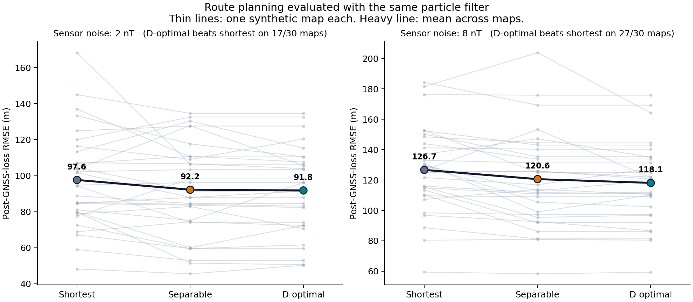

# Magnetic route planning evaluated with a particle filter

**Result: approximately 6–7% lower mean post-GNSS-loss localization RMSE than the
shortest route, at 1.85% greater mean distance, in this synthetic benchmark.**
The effect is clear at 8 nT sensor noise (27 of 30 maps, Wilcoxon p = 2e-6) and
marginal at 2 nT (17 of 30 maps, Wilcoxon p = 0.055). The prespecified 20%
improvement target was not reached. D-optimal routing did not show a clear RMSE
advantage over the separable magnetic-information baseline. This is a modest
positive result against shortest routing, not a breakthrough, field validation,
or quantum advantage.

## What was connected

Q-MagOpt selects a route using its accumulated Fisher matrix and exact
2-D determinant formulation. The numerical core extracted from Q-MagNav
propagates a particle filter along that route. This measures filter error,
rather than interpreting a theoretical CRLB reduction as achieved accuracy.
Exact classical route enumeration isolates the objective from the solver.
Neither QAOA nor a quantum sensor is used in this experiment.

There are 1,800 missions: 30 independently generated synthetic maps × 10 noise
repetitions × 2 sensor-noise levels × 3 routing methods. Each noise/method cell
contains 300 missions. This is 30 map clusters, not 1,800 independent maps.
See [frozen protocol](PROTOCOL.md) and [source versions](provenance.json).

The planner's objective is the determinant of the **posterior** information matrix,
det(J_prior + J_route), with an isotropic 200 m prior. That prior is part of the
Q-MagOpt objective and changes the ranking; it is asserted at run time rather than
assumed. Results below supersede the first run; see [Corrections](#corrections).

## Results

RMSE below is the mean of mission-level post-cutoff RMSEs, in metres.

| Sensor RMS | Shortest | Separable information | D-optimal | D-optimal reduction vs shortest (95% CI) | Maps favouring D-optimal |
|---|---:|---:|---:|---:|---:|
| 2 nT | 97.62 | 92.21 | 91.78 | 5.98% [0.78%, 11.40%] | 17/30 |
| 8 nT | 126.68 | 120.59 | 118.12 | 6.76% [4.36%, 9.22%] | 27/30 |

The two rows are not equally strong, and the difference matters more than the
similar percentages suggest. At 8 nT the bootstrap interval, the sign test
(p = 8e-6) and the paired Wilcoxon test (p = 2e-6) agree. At 2 nT the bootstrap
interval barely excludes zero while the rank evidence does not reach significance
(17/30 maps, sign test p = 0.58, Wilcoxon p = 0.055); the ratio-of-means estimator
is dominated by the highest-RMSE maps, and a handful of large wins carry it. The
defensible reading is that the benefit is established at 8 nT and suggestive at 2 nT.

D-optimal vs separable reductions are 0.46% [-2.48%, 3.22%] at 2 nT and
2.05% [-0.54%, 5.03%] at 8 nT. Both intervals include zero, and separable is the
better route on 20 of 30 maps at each noise level (sign test p = 0.099). So
D-optimal has the better mean and the worse median against separable: its advantage
comes from a few large wins rather than from winning more often. Nothing here
distinguishes the two information objectives.

These paired map-cluster bootstrap intervals describe uncertainty within this
synthetic generator; they do not establish performance on real terrain.

| Route method | Mean length | Additional distance vs shortest |
|---|---:|---:|
| Shortest | 8,000.00 m | 0% |
| Separable | 8,143.62 m | 1.80% |
| D-optimal | 8,147.73 m | 1.85% |

No route exceeded the 8,800 m budget. The longest selected route was 8,246.21 m.
The narrow corridor itself limits possible detours; the 10% budget does not bind
in this geometry. This experiment does not establish a full distance/accuracy
Pareto frontier or separate the value of extra travel from route placement.



## Large-error events: secondary evidence

A mission is counted if any post-cutoff error exceeds 250 m. This is an illustrative
proxy, not proof that a vehicle became lost or an operational safety threshold.

| Sensor RMS | Shortest | Separable | D-optimal |
|---|---:|---:|---:|
| 2 nT | 36/300 (12.00%) | 37/300 (12.33%) | 31/300 (10.33%) |
| 8 nT | 101/300 (33.67%) | 88/300 (29.33%) | 81/300 (27.00%) |

D-optimal's reduction against shortest is 1.67 percentage points
[−5.67, 9.00] at 2 nT and 6.67 points [3.33, 10.33] at 8 nT.
Against separable it is 2.00 points [−1.00, 6.00] and 2.33 points [−0.67, 6.00].
Secondary comparisons are exploratory and not adjusted for multiple comparisons.
No general claim of reduced loss probability is supported.

## Controls and limitations

- Planning only sees the stored map. Sensor observations use a separate true field
  with a smooth, spatially correlated 2 nT RMS map discrepancy. Its realization is
  not available to either route selection or the filter.
- Methods share endpoints, initial GNSS, odometry/noise seeds, particle count,
  measurement count and filter tuning. The nominal planner is fixed at 2 nT
  sensor noise plus 2 nT map error; 8 nT is a robustness scenario for those routes.
- The two noise arms now draw independent randomness, but they still share the same
  30 maps and the same selected routes, so they are not independent experiments:
  paired mission RMSEs correlate at r = 0.48. Treat them as one study at two
  operating points, not as replication.
- GNSS is deliberately removed at epoch 20. Spoof-detection logic is disabled
  with an infinite residual threshold, and spoofing is switched off outright.
  This does not measure spoofing detection.
- The sensor model retains the source's 4-degree odometry heading bias and
  magnetic drift. The filter only estimates position; there is no heading or
  magnetic-bias state. Better state estimation may change the ranking. Because the
  heading-bias error scales with step length, longer routes are mildly penalized,
  which works against the information routes rather than for them.
- The planner scores nine waypoints; the filter receives 161 measurement epochs
  along interpolated segments. Thus the static Fisher score is a proxy for the
  dynamic filtering problem, not its exact information matrix.
- The 200 m planner prior is a free parameter of the objective. It is declared and
  asserted, but it has not been varied, and the filter's own initial uncertainty
  (70 m particle spread plus 20 epochs of GNSS) is not the same quantity. A
  sensitivity sweep over this prior is the most obvious missing control.
- The three-row corridor is 500 m wide over 8 km. Independent maps are random
  draws from one anomaly generator, not real surveys. Sample count and duration
  are fixed, so longer routes imply higher speed; no energy or flight dynamics
  model is evaluated. Replanning and global localization are not tested.
- Uniform likelihood treatment of the map error approximates correlated errors
  as independent; the true simulated discrepancy is spatially correlated.

The current D-optimality identity remains useful, but maximizing a determinant
is not a theorem that RMS error always improves. For example, information matrices
`diag(1,100)` and `diag(9,9)` have determinants 100 and 81, while the first has
*worse* `trace(J^-1)`. Existing repository wording such as "never worse" should
be interpreted only as an observation on its tested cases. The per-map results
above are a concrete instance: D-optimal beats separable on average while losing
to it on two thirds of maps.

## Corrections

An audit of the first run (v1) found two randomization defects and three disclosure
gaps. None of them fabricated the result — every v1 number was recomputable from
its own `trials.csv` — but two of them weakened the evidence more than the write-up
implied. All five are fixed here and regression-tested; PROTOCOL.md records them as
amendments. The v1 outputs are preserved unchanged in `integrated_results_qmagopt_v1/`.

1. **The two noise arms were the same noise realization.** Seeds did not depend on
   the noise level, so the 8 nT magnetic noise was exactly four times the 2 nT noise
   and the drift, GNSS, odometry and filter streams were identical (paired mission
   RMSEs correlated at r = 0.77). Two agreeing rows read as corroboration but were
   one draw at two scalings. Fixed; correlation now 0.48, from shared maps and routes.
2. **RNG streams collided across trials.** With sensor = base+100, filter = base+500
   and bases spaced 100 apart, map *m*'s sensor stream equalled map *m−4*'s filter
   stream in 260 of 300 cells, coupling clusters the bootstrap assumes independent.
   Fixed with `SeedSequence` spawning.
3. **The 200 m planner prior was undeclared.** It defines the objective as the
   posterior determinant rather than the route determinant. Now documented, asserted
   at run time, and pinned by a test.
4. **The bundle could not be run.** `qmagopt` was imported but absent, and
   `magnav_core.simulate_sensors` called an undefined `make_trajectory`, working only
   because the benchmark assigned it at runtime. The trajectory is now an explicit
   argument, and `reference_planner.py` lets the study run standalone.
5. **The analysis reported only the ratio of means.** Per-map win rates and paired
   rank tests are now reported for every comparison, and the bar chart — whose bars
   occluded the per-map pairs — is a paired slope plot.

Effect on conclusions: the headline survives at a slightly smaller magnitude
(6.84% → 5.98% at 2 nT, 6.95% → 6.76% at 8 nT), the 8 nT arm is strengthened
(22/30 → 27/30 maps), the 2 nT arm is revealed as marginal rather than significant,
and the D-optimal-over-separable comparison remains null in both runs.

## Reproduce

From the repository root (requires NumPy, SciPy, pandas and Matplotlib):

```bash
# standalone, using the audited reference planner
OPENBLAS_NUM_THREADS=1 python experiments/magnav_benchmark/integrated_benchmark.py

# the Q-MagOpt integration, cross-checked against the reference on every map
OPENBLAS_NUM_THREADS=1 python experiments/magnav_benchmark/integrated_benchmark.py --planner qmagopt

python -m unittest discover -s experiments/magnav_benchmark -p test_integration.py -v
```

`reference_planner.py` reimplements the four `NavigationProblem` members this study
calls. It is validated against the recorded v1 Q-MagOpt output — all 577 candidates
per map, all 90 selected routes, all lengths, and all 90 determinants to 1e-9
relative — by `test_reference_planner_reproduces_recorded_qmagopt_output`, and
`--planner qmagopt` asserts the two agree on every map. It is a reference, not the
integration under test; results quoted above are from the reference path, which
produces byte-identical route selections.

The full run takes about ninety seconds on the tested CPU. Raw
[trials](integrated_results/trials.csv),
[summary and confidence intervals](integrated_results/summary.json),
[failure intervals](integrated_results/failure_intervals.json), and
[configuration](integrated_results/config.json) are included. Thirteen numerical
checks pass, covering interpolation, map independence and error budget, the flat-map
baseline, paired deterministic execution and cutoff, a determinant-vs-RMS
counterexample, noise-level seed independence, cross-trial stream collisions,
method pairing, explicit trajectory injection, spoofing being switched off, the
exact QUBO encoding on all 577 feasible routes, the declared prior, and reference
planner agreement with recorded Q-MagOpt output.
The older pytest suite was not executed because pytest was unavailable in the runtime.

## What is worth discussing with QOODA

The defensible finding is a measured, modest navigation improvement from route
selection using the same simulated sensor and filter, clear at the higher noise
level and suggestive at the lower one. The next useful validation is their
representative map/error model and a stronger localization baseline.
A proposal to test the planning module on such data is justified; a claim of
proven commercial value or superiority over their internal system is not.
